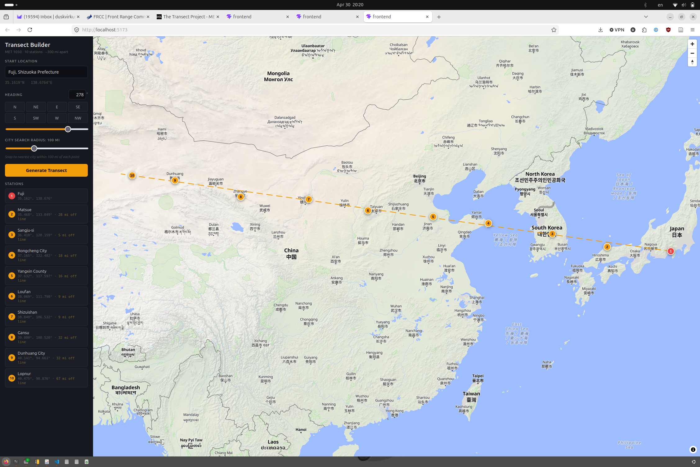

# Transect Project

MET 1050 interactive web tool for building and analyzing a climate transect — a line of weather stations across the Earth used to study how climate changes along a given path.

The project will cover all three parts of the assignment:
- **Part I** — Select and map 10 stations along a transect line
- **Part II** — Collect and display temperature and precipitation data for each station
- **Part III** — Analyze climate controls and classify stations by Köppen climate type

## Tech

- [React](https://react.dev/) + [Vite](https://vite.dev/)
- [MapLibre GL JS](https://maplibre.org/) via [react-map-gl](https://visgl.github.io/react-map-gl/) — WebGL map rendering
- [Turf.js](https://turfjs.org/) — rhumb-line station placement and distance calculations
- [OpenFreeMap](https://openfreemap.org/) — free OpenStreetMap vector tiles (no API key required)
- [Nominatim](https://nominatim.org/) — OSM geocoding and reverse geocoding

## Getting Started

```bash
cd frontend
npm install
npm run dev
```

Open http://localhost:5173.

## Transect Builder

Available at `/builder`. Pick a starting location and heading, and the app plots 10 weather stations at ~300-mile intervals along that line using rhumb-line (constant bearing) navigation. Each station is reverse-geocoded to the nearest city via OpenStreetMap.



- Click the map or search by city name to set a start point
- Set heading via compass quick-buttons, drag slider, or type a degree value
- Adjustable city search radius — snaps each station to the nearest city within N miles of the exact transect point, with offset distance shown

## Tests

```bash
cd frontend
npm test
```

Unit tests live in `src/transect.test.js` and cover station placement for all cardinal and diagonal headings, and spacing between stations.
