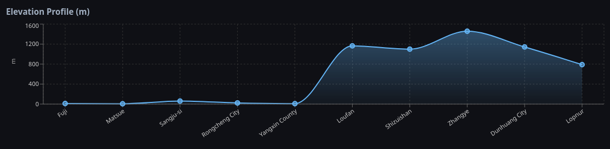
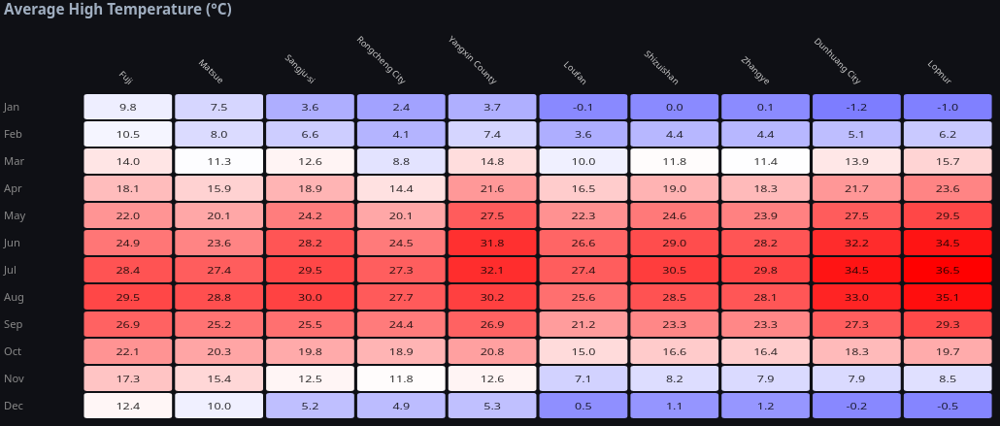
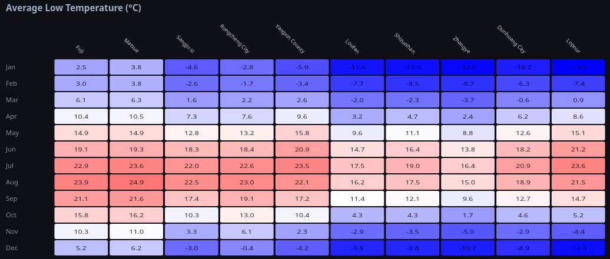
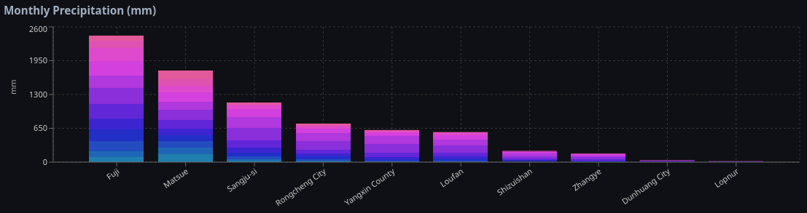

# Transect Report: Japan to Xinjiang

**For the full interactive experience, visit: https://duskvirkus.github.io/transect-project/**

---

## Overview

This transect runs westward from Fuji, Shizuoka on the Pacific coast of Japan (35.16°N, 138.68°E) across the Sea of Japan, through the Korean Peninsula, across the North China Plain, along the Hexi Corridor, and into the Tarim Basin of Xinjiang, terminating near Lop Nur. The transect spans roughly 4,700 km and crosses a dramatic gradient from humid subtropical coastal climate to hyperarid continental desert.

---

## Station Data

| # | Station | Latitude | Longitude | Elevation (m) | Population |
|---|---------|----------|-----------|---------------|------------|
| 0 | Fuji, Shizuoka | 35.1619°N | 138.6764°E | 10 | 245,015 [5] |
| 1 | Matsue | 35.4681°N | 133.0488°E | 6 | 196,748 [6] |
| 2 | Sangju-si | 36.4104°N | 128.1591°E | 60 | 101,237 [8] |
| 3 | Rongcheng City | 37.1649°N | 122.4823°E | 23 | 738,600 [9] |
| 4 | Yangxin County | 37.6319°N | 117.5974°E | 9 | 901,971 [10] |
| 5 | Loufan County | 38.0691°N | 111.7981°E | 1,165 | 91,208 [11] |
| 6 | Shizuishan | 38.8402°N | 106.5323°E | 1,099 | 730,400 [12] |
| 7 | Zhangye | 38.9247°N | 100.4500°E | 1,458 | 1,199,515 [13] |
| 8 | Dunhuang City | 40.1411°N | 94.6608°E | 1,142 | 185,231 [14] |
| 9 | Lopnur | 40.4747°N | 90.8759°E | 789 | 4,300 [16] |

Station locations and coordinates: [5][6][7][9][10][11][12][13][14][15]

---

## Climate Data

Climate normals based on ERA5 reanalysis data (1996–2025). All temperatures in °C; precipitation in mm. [1]

### Monthly Average High Temperature (°C)

| Station | Jan | Feb | Mar | Apr | May | Jun | Jul | Aug | Sep | Oct | Nov | Dec |
|---------|-----|-----|-----|-----|-----|-----|-----|-----|-----|-----|-----|-----|
| Fuji | 9.8 | 10.5 | 14.0 | 18.1 | 22.0 | 24.9 | 28.4 | 29.5 | 26.9 | 22.1 | 17.3 | 12.4 |
| Matsue | 7.5 | 8.0 | 11.3 | 15.9 | 20.1 | 23.6 | 27.4 | 28.8 | 25.2 | 20.3 | 15.4 | 10.0 |
| Sangju | 3.6 | 6.6 | 12.6 | 18.9 | 24.2 | 28.2 | 29.5 | 30.0 | 25.5 | 19.8 | 12.5 | 5.2 |
| Rongcheng | 2.4 | 4.1 | 8.8 | 14.4 | 20.1 | 24.5 | 27.3 | 27.7 | 24.4 | 18.9 | 11.8 | 4.9 |
| Yangxin | 3.7 | 7.4 | 14.8 | 21.6 | 27.5 | 31.8 | 32.1 | 30.2 | 26.9 | 20.8 | 12.6 | 5.3 |
| Loufan | −0.1 | 3.6 | 10.0 | 16.5 | 22.3 | 26.6 | 27.4 | 25.6 | 21.2 | 15.0 | 7.1 | 0.5 |
| Shizuishan | 0.0 | 4.4 | 11.8 | 19.0 | 24.6 | 29.0 | 30.5 | 28.5 | 23.3 | 16.6 | 8.2 | 1.1 |
| Zhangye | 0.1 | 4.4 | 11.4 | 18.3 | 23.9 | 28.2 | 29.8 | 28.1 | 23.3 | 16.4 | 7.9 | 1.2 |
| Dunhuang | −1.2 | 5.1 | 13.9 | 21.7 | 27.5 | 32.2 | 34.5 | 33.0 | 27.3 | 18.3 | 7.9 | −0.2 |
| Lopnur | −1.0 | 6.2 | 15.7 | 23.6 | 29.5 | 34.5 | 36.5 | 35.1 | 29.3 | 19.7 | 8.5 | −0.5 |

### Monthly Average Low Temperature (°C)

| Station | Jan | Feb | Mar | Apr | May | Jun | Jul | Aug | Sep | Oct | Nov | Dec |
|---------|-----|-----|-----|-----|-----|-----|-----|-----|-----|-----|-----|-----|
| Fuji | 2.5 | 3.0 | 6.1 | 10.4 | 14.9 | 19.1 | 22.9 | 23.9 | 21.1 | 15.8 | 10.3 | 5.2 |
| Matsue | 3.8 | 3.8 | 6.3 | 10.5 | 14.9 | 19.3 | 23.6 | 24.9 | 21.6 | 16.2 | 11.0 | 6.2 |
| Sangju | −4.6 | −2.6 | 1.6 | 7.3 | 12.8 | 18.3 | 22.0 | 22.5 | 17.4 | 10.3 | 3.3 | −3.0 |
| Rongcheng | −2.8 | −1.7 | 2.2 | 7.6 | 13.2 | 18.4 | 22.6 | 23.0 | 19.1 | 13.0 | 6.1 | −0.4 |
| Yangxin | −5.9 | −3.4 | 2.6 | 9.6 | 15.8 | 20.9 | 23.5 | 22.1 | 17.2 | 10.4 | 2.3 | −4.2 |
| Loufan | −11.6 | −7.7 | −2.0 | 3.2 | 9.6 | 14.7 | 17.5 | 16.2 | 11.4 | 4.3 | −2.9 | −9.9 |
| Shizuishan | −12.0 | −8.5 | −2.3 | 4.7 | 11.1 | 16.4 | 19.0 | 17.5 | 12.1 | 4.3 | −3.5 | −9.8 |
| Zhangye | −12.8 | −8.7 | −3.7 | 2.4 | 8.8 | 13.8 | 16.4 | 15.0 | 9.6 | 1.7 | −5.0 | −10.7 |
| Dunhuang | −10.7 | −6.3 | −0.6 | 6.2 | 12.6 | 18.2 | 20.9 | 18.9 | 12.7 | 4.6 | −2.9 | −8.9 |
| Lopnur | −13.5 | −7.4 | 0.9 | 8.6 | 15.1 | 21.2 | 23.6 | 21.5 | 14.7 | 5.2 | −4.4 | −12.3 |

### Monthly Precipitation (mm)

| Station | Jan | Feb | Mar | Apr | May | Jun | Jul | Aug | Sep | Oct | Nov | Dec | **Annual** |
|---------|-----|-----|-----|-----|-----|-----|-----|-----|-----|-----|-----|-----|-----------|
| Fuji | 91.8 | 118.4 | 201.1 | 213.1 | 215.7 | 281.7 | 301.8 | 233.2 | 291.8 | 240.5 | 145.8 | 90.8 | **2,325.7** |
| Matsue | 157.1 | 120.8 | 130.3 | 112.7 | 127.9 | 157.8 | 197.9 | 149.2 | 191.0 | 122.6 | 121.9 | 167.0 | **1,756.2** |
| Sangju | 21.7 | 29.1 | 54.6 | 81.1 | 95.6 | 136.4 | 242.6 | 205.9 | 154.8 | 64.1 | 35.5 | 21.7 | **1,143.1** |
| Rongcheng | 15.3 | 18.1 | 23.7 | 49.2 | 58.2 | 77.8 | 162.1 | 155.2 | 79.8 | 43.3 | 36.9 | 19.9 | **739.5** |
| Yangxin | 4.8 | 11.5 | 13.7 | 29.6 | 44.2 | 78.4 | 162.5 | 161.8 | 46.3 | 39.2 | 19.7 | 5.4 | **617.1** |
| Loufan | 4.7 | 11.2 | 18.7 | 39.4 | 44.2 | 69.2 | 130.9 | 120.0 | 76.0 | 45.7 | 17.0 | 4.3 | **581.3** |
| Shizuishan | 1.8 | 2.5 | 7.5 | 11.0 | 19.2 | 29.4 | 46.6 | 45.2 | 36.2 | 12.0 | 4.9 | 1.2 | **217.5** |
| Zhangye | 1.9 | 2.1 | 4.5 | 8.6 | 15.4 | 22.9 | 40.6 | 35.5 | 23.1 | 8.0 | 2.9 | 2.8 | **168.3** |
| Dunhuang | 0.7 | 0.8 | 1.5 | 2.9 | 5.7 | 8.0 | 7.6 | 6.2 | 2.4 | 0.7 | 1.3 | 1.4 | **39.2** |
| Lopnur | 0.2 | 0.2 | 0.7 | 1.8 | 3.0 | 2.6 | 4.3 | 2.9 | 0.6 | 0.7 | 1.2 | 0.6 | **18.8** |

Source: [1]

---

## Analysis

### Köppen-Geiger Classification Map

*[Insert screenshot of Köppen-Geiger map with transect overlay]*

The transect crosses the following Köppen-Geiger climate zones west to east [2]:

- **Cfa** — Humid subtropical (Fuji)
- **Cfa/Cfb** — Humid subtropical / Oceanic (Matsue, Sea of Japan coast)
- **Dwa** — Humid continental, dry winter (Sangju, Korean interior)
- **Dwa** — Humid continental, dry winter (Rongcheng, Shandong Peninsula)
- **Dwa** — Humid continental, dry winter (Yangxin, North China Plain)
- **BSk** — Cold steppe (Loufan, Loess Plateau transition)
- **BWk** — Cold desert (Shizuishan, Ningxia)
- **BWk** — Cold desert (Zhangye, Hexi Corridor)
- **BWk** — Cold desert (Dunhuang, Gobi margin)
- **BWk** — Cold desert (Lopnur, Tarim Basin)

Map tiles: [3][4]

---

### Elevation Profile

The transect is largely low-lying through Japan, Korea, and the North China Plain before rising onto the Loess Plateau at Loufan (~1,165 m) [11]. Shizuishan and Dunhuang sit around 1,100–1,142 m [12][14]. Zhangye is the highest station at 1,458 m [13]. The transect ends at Lopnur in the Tarim Basin at 789 m — a depression enclosed by some of the tallest mountains on Earth [15].

---

### Temperature Heatmaps

The heatmaps illustrate the strong west-to-east cooling in winter (January lows drop from +2.5°C at Fuji to −13.5°C at Lopnur) and the intensification of summer heat at continental interior stations (July highs reach 36.5°C at Lopnur vs. 28.4°C at Fuji). The maritime stations show the smallest seasonal range; the desert interior stations the largest. [1]

---

### Monthly Precipitation Chart

Precipitation decreases dramatically westward. Fuji receives ~2,326 mm annually, fed by Pacific typhoons and the Kuroshio-enhanced monsoon [5][18]. By Shizuishan the total drops to ~218 mm [12]; Dunhuang receives ~39 mm [14]; Lopnur receives less than 19 mm [15][16]. The monsoon signal (July–August peak) is visible through Sangju and Rongcheng but disappears west of the Loess Plateau [1].

---

## Station Details

---

### Station 0 — Fuji, Shizuoka

Fuji is a city in Shizuoka Prefecture on the Pacific coast of central Honshu, located at the foot of Mount Fuji. It has a humid subtropical climate (Cfa) with year-round precipitation and hot, humid summers. [5]

**Latitude / Insolation:** At approximately 35°N, Fuji lies at a mid-latitude position where seasonal contrasts in solar angle and day length produce distinct summer and winter seasons. [5]

**Land-Sea Distribution:** Situated on the Pacific coast, Fuji benefits from maritime influence that moderates temperature extremes and supplies year-round moisture from the Pacific Ocean. [5]

**Ocean Currents:** The Kuroshio Current flows northeastward along the Pacific coast of Japan, warming coastal waters and delivering moisture that contributes to high annual precipitation at Fuji. [18]

**Prevailing Winds:** The East Asian monsoon drives warm, moist southerly winds inland in summer, bringing heavy rainfall. In winter, cold, dry northwesterly winds from the Siberian interior dominate. [5]

**Pressure Systems:** The Siberian High drives cold, dry northwesterly monsoon winds in winter. The North Pacific High (Ogasawara High) expands northwestward in summer, steering warm, moist air into Japan. The Aleutian Low contributes to winter storm activity in the surrounding Pacific region. [20][21][22]

**Mountains / Topography:** Mount Fuji (3,776 m) is the dominant topographic feature, producing significant orographic lift and amplifying precipitation on its windward slopes. [5]

**Altitude:** The city occupies low-elevation coastal terrain (roughly 5–50 m above sea level), so altitude has minimal direct effect on its temperature regime. [5]

---

### Station 1 — Matsue

Matsue is the capital of Shimane Prefecture, situated on the coast of the Sea of Japan at the western end of Honshu. It is known for its historic castle and experiences some of the heaviest winter snowfall in Japan, fed by cold air masses crossing the Sea of Japan. [6]

**Latitude / Insolation:** At approximately 35.5°N, Matsue experiences mid-latitude insolation with marked seasonal differences in solar angle — warm summers and cold winters. [6]

**Land-Sea Distribution:** Matsue's position on the Sea of Japan coast means cold Siberian air masses pick up substantial moisture while crossing the sea in winter, releasing it as heavy snow on the coastal plain. [6]

**Ocean Currents:** The Tsushima Warm Current, a branch of the Kuroshio, flows through the Korea Strait and into the Sea of Japan, keeping sea-surface temperatures elevated and maximizing moisture uptake by winter air masses that then deposit heavy snowfall on the coast. [19][18]

**Prevailing Winds:** Prevailing winter winds blow from the northwest off the Asian continent, crossing the Sea of Japan and arriving laden with moisture. Summer winds shift to the south with the East Asian monsoon. [6]

**Pressure Systems:** The Siberian High dominates in winter, driving cold, dry air masses that pick up moisture over the Sea of Japan and deposit it as heavy snow on the coast. The North Pacific High in summer reduces precipitation relative to Japan's Pacific coast. The Aleutian Low modulates winter storm tracks in the North Pacific region. [20][21][22]

**Mountains / Topography:** The Chugoku Mountains to the south separate the Sea of Japan coast from the Pacific side, preventing Pacific maritime air from reaching Matsue and reinforcing the Sea of Japan influence. [6]

**Altitude:** Matsue sits near sea level (approximately 5–15 m), so altitude plays little role in its climate. [6]

---

### Station 2 — Sangju-si

Sangju is a city in North Gyeongsang Province in the interior of the Korean Peninsula, historically known for agriculture and silk production. [7]

**Latitude / Insolation:** At approximately 36.4°N, Sangju receives mid-latitude insolation with clear seasonal contrasts between warm summers and cold winters. [7]

**Land-Sea Distribution:** Sangju lies in the interior of the Korean Peninsula, separated from both the Yellow Sea and the East Sea by mountain ranges, producing a more continental climate than coastal Korean cities. [7]

**Ocean Currents:** Not applicable — Sangju is located in the interior of the Korean Peninsula, beyond the direct influence of any ocean current.

**Prevailing Winds:** Cold, dry northwesterly winds from the Siberian High dominate in winter. The East Asian monsoon brings warm, moist air from the south in summer, delivering the majority of annual rainfall. [7]

**Pressure Systems:** The Siberian High is the dominant winter pressure system, producing cold, dry continental conditions. The North Pacific subtropical high expands in summer, driving the East Asian monsoon and delivering most annual precipitation. [20][21]

**Mountains / Topography:** The Taebaek Mountains to the east and the Sobaek Mountains to the south create a partial rain shadow, contributing to drier and more continental conditions relative to the coasts. [7]

**Altitude:** Sangju is situated at approximately 130 m elevation on an inland basin, slightly reducing temperatures compared to lower-elevation coastal cities at the same latitude. [7]

---

### Station 3 — Rongcheng, Shandong

Rongcheng is a county-level city at the eastern tip of the Shandong Peninsula, surrounded on three sides by the Yellow Sea and Bohai Sea. Its peninsula location gives it a relatively temperate climate moderated by the surrounding sea. [9]

**Latitude / Insolation:** At approximately 37°N, Rongcheng receives mid-latitude insolation. Its latitude places it at the warmer end of the transect's eastern stations. [9]

**Land-Sea Distribution:** The Shandong Peninsula location means Rongcheng is surrounded by sea on three sides, which moderates temperature extremes and reduces the severity of both summer heat and winter cold compared to the interior. [9]

**Ocean Currents:** The Yellow Sea and Bohai Sea provide some seasonal thermal moderation to the Shandong Peninsula coast, though this coast lacks a strong persistent warm current comparable to the Kuroshio off Japan. [9]

**Prevailing Winds:** The East Asian monsoon brings warm, moisture-laden southeasterly winds in summer, producing most of the annual rainfall. In winter, cold northwesterly monsoon winds arrive from the continental interior. [9]

**Pressure Systems:** The Siberian High dominates in winter, producing cold, dry northwesterly winds. The North Pacific subtropical high drives the East Asian summer monsoon, delivering most of the annual precipitation. [20][21]

**Mountains / Topography:** The Shandong Peninsula is relatively flat, so topographic effects on climate are minor compared to the dominant maritime influence. [9]

**Altitude:** Rongcheng lies near sea level on the peninsula, so altitude has negligible impact on its temperature regime. [9]

---

### Station 4 — Yangxin County

This transect station falls within the North China Plain in Hebei Province, a region of flat agricultural lowlands experiencing a temperate continental monsoon climate with cold, dry winters and warm, wet summers. [10]

**Latitude / Insolation:** At approximately 37.6°N, this station receives mid-latitude insolation with significant seasonal variation — cold winters and warm summers characterize the continental interior. [10]

**Land-Sea Distribution:** Positioned inland from the Bohai coast, this station experiences a noticeably more continental climate than the Shandong Peninsula stations, with reduced maritime moderation and larger temperature swings. [10]

**Ocean Currents:** Not applicable — this station is located inland on the North China Plain, beyond the direct influence of any ocean current.

**Prevailing Winds:** The East Asian monsoon delivers warm, moist southeasterly winds and most annual rainfall in summer. Cold, dry northwesterly winds from the Siberian High dominate in winter, producing very cold and dry conditions. [10]

**Pressure Systems:** The Siberian High is the dominant winter pressure system, driving cold dry air southward across the region. In summer it weakens and the North Pacific High steers monsoon moisture into the area. [20][21]

**Mountains / Topography:** The North China Plain is exceptionally flat, so terrain has minimal direct effect on climate. The lack of topographic barriers allows cold winter winds to penetrate freely from the north. [10]

**Altitude:** The station sits on the North China Plain at low elevation (approximately 10–50 m), so altitude has negligible effect on temperatures. [10]

---

### Station 5 — Loufan County

Loufan County is a mountainous county in the Lüliang Mountains of Shanxi Province, situated on the Loess Plateau. Its relatively high elevation produces a cool semi-arid climate with cold winters and summer-concentrated rainfall. [11]

**Latitude / Insolation:** At approximately 38°N, Loufan receives mid-latitude insolation. The seasonal cycle is amplified by the inland continental location. [11]

**Land-Sea Distribution:** Loufan is deep in the continental interior of northern China, far from any ocean, producing low annual precipitation and large temperature swings between summer and winter. [11]

**Ocean Currents:** Not applicable — Loufan is located in the continental interior of Shanxi Province, far beyond the influence of any ocean current.

**Prevailing Winds:** Dry westerly and northwesterly winds dominate in winter, bringing cold, arid air from the Mongolian Plateau. Summer monsoon winds reach Loufan weakened, delivering limited but concentrated rainfall. [11]

**Pressure Systems:** The Siberian High dominates in winter, bringing cold, dry air from the Mongolian Plateau. Summer sees some weakening of the continental high and limited monsoon penetration, but Pacific pressure systems have minimal direct influence this far inland. [20]

**Mountains / Topography:** The Lüliang Mountains surround Loufan, creating a basin on the Loess Plateau. The mountains intercept what little moisture arrives from the east, contributing to the semi-arid climate. [11]

**Altitude:** Loufan sits at approximately 1,100–1,200 m above sea level, which substantially lowers mean temperatures relative to lower-elevation locations at the same latitude. [11]

---

### Station 6 — Shizuishan

Shizuishan is a prefecture-level city in the Ningxia Hui Autonomous Region, situated along the Yellow River at the edge of the Tengger Desert. It has a temperate arid continental climate with scarce precipitation and extreme seasonal temperatures. [12]

**Latitude / Insolation:** At approximately 38.8°N, Shizuishan receives mid-latitude insolation with a pronounced annual temperature cycle driven by its continental interior position. [12]

**Land-Sea Distribution:** Located more than 1,000 km from the nearest ocean coast, Shizuishan experiences a strongly continental climate with minimal maritime moderation — very cold winters and hot summers. [12]

**Ocean Currents:** Not applicable — Shizuishan is located in the continental interior of Ningxia, far beyond the influence of any ocean current.

**Prevailing Winds:** Dry northwesterly winds from the Gobi Desert and Mongolian Plateau dominate year-round. The summer East Asian monsoon barely reaches this far west, resulting in very low annual precipitation. [12]

**Pressure Systems:** The Siberian High is the dominant pressure system in winter, producing very cold, dry conditions. Pacific pressure systems have minimal influence at this distance inland; summer is controlled by a continental thermal regime. [20]

**Mountains / Topography:** The Helan Mountains to the west form a barrier that reduces westward moisture transport. The city sits in the upper Yellow River valley between the Ordos Plateau to the east and the Helan Mountains to the west. [12]

**Altitude:** Shizuishan lies at approximately 1,100 m above sea level in the Yellow River valley, which contributes to cooler temperatures than sea-level locations at the same latitude. [12]

---

### Station 7 — Zhangye

Zhangye is a prefecture-level city in the Hexi Corridor of Gansu Province, lying between the Qilian Mountains to the south and the Beishan ranges to the north. It has an arid continental climate with cold winters, warm summers, and very low annual precipitation. [13]

**Latitude / Insolation:** At approximately 38.9°N, Zhangye receives mid-latitude insolation. Its interior position means the seasonal temperature contrast is much larger than its latitude alone would suggest. [13]

**Land-Sea Distribution:** The Hexi Corridor is one of the most isolated inland locations in Asia, situated over 2,000 km from the Pacific Ocean. The result is an extremely continental climate with minimal precipitation and very large diurnal and annual temperature ranges. [13]

**Ocean Currents:** Not applicable — Zhangye is located in the Hexi Corridor of Gansu, thousands of kilometres from any coast. No ocean current has any influence on its climate.

**Prevailing Winds:** The Hexi Corridor acts as a wind channel, funneling westerly and northwesterly winds. The East Asian summer monsoon does not penetrate this far into the interior, so precipitation is sparse year-round. [13]

**Pressure Systems:** The Siberian High controls winter climate, driving frigid, dry conditions through the Hexi Corridor. Summers see some thermal low development over the corridor, but the monsoon circulation does not penetrate this far inland regardless of Pacific pressure patterns. [20]

**Mountains / Topography:** The Qilian Mountains (reaching 5,000+ m) to the south form a massive barrier that blocks moisture and creates a pronounced rain shadow over the Hexi Corridor. [13]

**Altitude:** Zhangye city is situated at approximately 1,483 m above sea level, significantly lowering mean temperatures compared to what its latitude alone would predict. [13]

---

### Station 8 — Dunhuang

Dunhuang is an oasis city in Gansu Province between the Gobi and Taklamakan deserts, historically significant as a Silk Road stop and home to the Mogao Caves UNESCO World Heritage Site. It receives less than 40 mm of precipitation annually and experiences extreme temperature swings. [14]

**Latitude / Insolation:** At approximately 40°N, Dunhuang receives mid-latitude insolation with strong seasonal contrasts — long, hot summer days and cold, short winter days. [14]

**Land-Sea Distribution:** Dunhuang is among the most isolated locations from any ocean on Earth, situated in a desert basin ringed by high mountains. No maritime influence reaches the city, producing hyperarid conditions. [14]

**Ocean Currents:** Not applicable — Dunhuang is located at the edge of the Gobi and Taklamakan deserts, far beyond the reach of any ocean current.

**Prevailing Winds:** Strong, dry westerly and northwesterly winds dominate throughout the year. The summer monsoon cannot penetrate the Qilian and Altyn-Tagh mountain barriers, leaving the city beyond the reach of monsoon moisture. [14]

**Pressure Systems:** The Siberian High dominates in winter, producing very cold, dry conditions. Summers are hot with a local thermal low over the desert basin, but surrounding mountain barriers prevent monsoon moisture from reaching the region regardless of synoptic pressure patterns. [20]

**Mountains / Topography:** Dunhuang lies in a basin between the Qilian Mountains to the south and the Beishan to the north. Both ranges block moisture from reaching the city, reinforcing the hyperarid desert environment. [14]

**Altitude:** The city is situated at approximately 1,138 m above sea level. This elevation, combined with the desert environment, produces large diurnal temperature swings and very cold winters. [14]

---

### Station 9 — Lopnur

Lop Nur is a dried salt lake bed in the Tarim Basin of Xinjiang, one of the most remote and arid locations in Asia. The nearest settlement is Luobupo Town with a population of approximately 4,300. [15][16]

**Latitude / Insolation:** At approximately 40.5°N, the Lop Nur area receives mid-latitude insolation. Summers are intensely hot due to the desert surface and trapped heat in the enclosed basin; winters are frigid. [15]

**Land-Sea Distribution:** The Tarim Basin is perhaps the most landlocked major basin on Earth, enclosed by the Kunlun Mountains, Tian Shan, and Pamir Plateau. No oceanic moisture reaches this area, producing hyperarid desert conditions. [15]

**Ocean Currents:** Not applicable — Lop Nur is located in the heart of the Tarim Basin in Xinjiang, one of the most remote inland locations in the world. No ocean current has any influence on its climate.

**Prevailing Winds:** Dry westerly winds dominate the basin. The enclosing mountain ranges prevent moisture-bearing air masses from entering from any direction, so precipitation is negligible year-round. [15]

**Pressure Systems:** The Tarim Basin is dominated by the continental high-pressure regime derived from the Siberian High in winter. No maritime pressure systems influence this location; the enclosing mountains isolate the basin from any external moisture-bearing circulation. [20]

**Mountains / Topography:** The Tarim Basin is completely enclosed by the Kunlun Mountains (south, up to 7,000+ m), the Tian Shan (north), and the Pamir Plateau (west). This total enclosure creates the most extreme continental rain shadow in Asia. [15]

**Altitude:** The Lop Nur basin floor lies at approximately 780 m above sea level. The enclosed basin geometry traps heat in summer and cold in winter, producing extreme temperature ranges despite the relatively modest elevation. [15][17]

---

## Bibliography

### Data & Reference Sources

[1] Zippenfenig, P. (2023). Open-Meteo.com Weather API. *Zenodo*. https://doi.org/10.5281/zenodo.7970649

[2] Beck, H. E., Zimmermann, N. E., McVicar, T. R., Vergopolan, N., Berg, A., & Wood, E. F. (2018). Present and future Köppen-Geiger climate classification maps at 1-km resolution. *Scientific Data*, 5, 180214. https://doi.org/10.1038/sdata.2018.214

[3] OpenFreeMap contributors. (2026). OpenFreeMap — free vector map tiles. *OpenFreeMap*. https://openfreemap.org

[4] OpenStreetMap contributors. (2026). OpenStreetMap. *OpenStreetMap Foundation*. https://www.openstreetmap.org/copyright

[5] Wikipedia contributors. (2026). Fuji, Shizuoka. *Wikipedia, The Free Encyclopedia*. https://en.wikipedia.org/wiki/Fuji,_Shizuoka

[6] Wikipedia contributors. (2026). Matsue. *Wikipedia, The Free Encyclopedia*. https://en.wikipedia.org/wiki/Matsue

[7] Wikipedia contributors. (2026). Sangju. *Wikipedia, The Free Encyclopedia*. https://en.wikipedia.org/wiki/Sangju

[8] Sangju City. (2026). Sangju City — Official Statistics. *Sangju City Government*. https://www.sangju.go.kr/eng/page/15013/10790.tc

[9] Wikipedia contributors. (2026). Rongcheng, Shandong. *Wikipedia, The Free Encyclopedia*. https://en.wikipedia.org/wiki/Rongcheng,_Shandong

[10] Wikipedia contributors. (2026). Yangxin County, Hubei. *Wikipedia, The Free Encyclopedia*. https://en.wikipedia.org/wiki/Yangxin_County,_Hubei

[11] Wikipedia contributors. (2026). Loufan County. *Wikipedia, The Free Encyclopedia*. https://en.wikipedia.org/wiki/Loufan_County

[12] Wikipedia contributors. (2026). Shizuishan. *Wikipedia, The Free Encyclopedia*. https://en.wikipedia.org/wiki/Shizuishan

[13] Wikipedia contributors. (2026). Zhangye. *Wikipedia, The Free Encyclopedia*. https://en.wikipedia.org/wiki/Zhangye

[14] Wikipedia contributors. (2026). Dunhuang. *Wikipedia, The Free Encyclopedia*. https://en.wikipedia.org/wiki/Dunhuang

[15] Wikipedia contributors. (2026). Lop Nur. *Wikipedia, The Free Encyclopedia*. https://en.wikipedia.org/wiki/Lop_Nur

[16] Baidu Baike. (2026). Lop Nor Town. *Baidu Baike*. https://baike.baidu.com/en/item/Lop%20Nor%20Town/933310

[17] NASA Earth Observatory. (2011). Lop Nur, Xinjiang, China. *NASA Earth Observatory*. https://science.nasa.gov/earth/earth-observatory/lop-nur-xinjiang-china-51039/

[18] Blue Japan. (2026). Currents of Japan. *Blue Japan*. https://bluejapan.org/geography/currents-of-japan/

[19] Britannica editors. (2026). Tsushima Current. *Encyclopaedia Britannica*. https://www.britannica.com/place/Tsushima-Current

[20] Wikipedia contributors. (2026). Siberian High. *Wikipedia, The Free Encyclopedia*. https://en.wikipedia.org/wiki/Siberian_High

[21] Wikipedia contributors. (2026). North Pacific High. *Wikipedia, The Free Encyclopedia*. https://en.wikipedia.org/wiki/North_Pacific_High

[22] Wikipedia contributors. (2026). Aleutian Low. *Wikipedia, The Free Encyclopedia*. https://en.wikipedia.org/wiki/Aleutian_Low

### Tools & Libraries

[23] Meta Platforms, Inc. (2026). React — The library for web and native user interfaces. *Meta Open Source*. https://react.dev

[24] VoidZero Inc. and Vite contributors. (2026). Vite — Next Generation Frontend Tooling. *Vite*. https://vitejs.dev

[25] Shopify, Inc. (2026). React Router. *Shopify, Inc.* https://reactrouter.com

[26] MapLibre contributors. (2026). MapLibre GL JS — Open-source mapping library. *MapLibre*. https://maplibre.org/maplibre-gl-js/docs/

[27] OpenJS Foundation and vis.gl contributors. (2026). react-map-gl — React components for MapLibre GL JS. *OpenJS Foundation*. https://visgl.github.io/react-map-gl/

[28] Recharts Group. (2026). Recharts — Redefined chart library built with React and D3. *Recharts*. https://recharts.org

[29] Turfjs contributors. (2026). Turf.js — Advanced geospatial analysis for browsers and Node.js. *Turfjs*. https://turfjs.org

[30] Anthropic, PBC. (2026). Claude Code — Agentic AI coding tool. *Anthropic*. https://claude.ai/code

[31] Glasmeyer, J. (2026). GitHub Gist — jonathanglasmeyer. *GitHub Gist*. https://gist.github.com/jonathanglasmeyer/3a9e508a977cee38dfadf0dbace92f53
